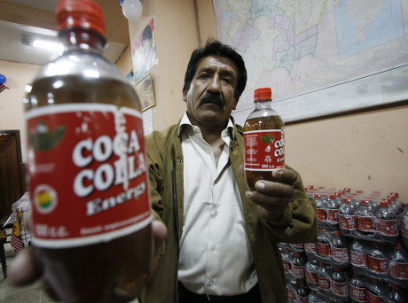

# Cocteleria Kris - Backend
This is the source code for the Cocteleria Kris' backend.


The project relies on Object Oriented Programming
and a Model-~~View~~-Controller architecture
(without the views, since it's just an API).

The choice of these architecture styles is purely arbitrary,
there is no reason to use them over others.


## Libraries
### dotnetenv
Used to read .env files.
The filesystem's location is specified in an environment variable.

### System.Data.SQLite
Idiomatic support to interact with the Sqlite database.

### Microsoft.IdentityModel.Tokens
Library that provides a set of tools to interact with JWT with ease,
aswell as other authentication technologies.

### System.IdentityModel.Tokens.Jwt
Cocteleria Kris uses JWT as its main authentication method,
which is already supported by Microsoft itself.

### BCrypt.Net-Next
Cryptography library that we used to hash and verify hashed passwords.

### Microsoft.AspNetCore.Authentication.JwtBearer
JWT middleware to recieve the bearer token,
used when adding authentications to the program.

### Microsoft.EntityFrameworkCore.Design
Tool to ease things up when creating new models and controllers.

### Microsoft.EntityFrameworkCore.Tools
Works hand-in-hand with Microsoft.EntityFrameworkCore.Design
to provide extra efficiency when developing projects in DOTNET.

### Newtonsoft (not used)
Newtonsoft has not been used because ASP.NET already formatted structs as JSON responses,
so there has never been a moment to actually use it.


### Directory layout
```
.
├── Controllers   # Where the controllers go
├── Migrations
├── Data          # Contains the ApplicationDbContext, which translates C# names into the ones in the database
├── Models        # Structures for the drinks, mainly
├── Properties
├── Repository    # Handles calls to the database
├── Services      # Manages JWTs and authentication
└── Views
```

### API data
The api data is taken from init_alt.sql,
which is an sqlite script that contains information of
every single drink in the game "Va-11 Hall-a".
It's a modified version from the initial script in [hud0shnik/vallhallaapi](https://github.com/hud0shnik/vallhallaapi).

SQLite is the technology being used to store data because
of its portability and ease of use.

## Drinks

- api/drinks with optional query parameters \[alcoholic: bool\] \[type: string\] \[flavour: string\]

```bash
# all
curlie https://kris.niliara.net/api/drinks

# one
curlie https://kris.niliara.net/api/drinks/{id}

# filters
curlie https://kris.niliara.net/api/drinks?alcoholic=false
curlie https://kris.niliara.net/api/drinks?type=Classy
curlie https://kris.niliara.net/api/drinks?flavour=Sour
curlie https://kris.niliara.net/api/drinks/?name=Gut

# order # false for reverse order
curlie :5013/api/drinks?orderByPrice=true
```

You can now create/modify/delete drinks
following the model and adding an image
as multipart/formdata and using JWT.


## JWT and user management
Authentication now works with FormData,
and user creation requires an image called imageFile aswell.

```
# Registration endpoint
/apu/auth/register

# Login endpoint
/api/auth/login

# Protected endpoint
/home/boniato
```

# Hosting
This backend is currently being hosted at [kris.niliara.net](https://kris.niliara.net).
